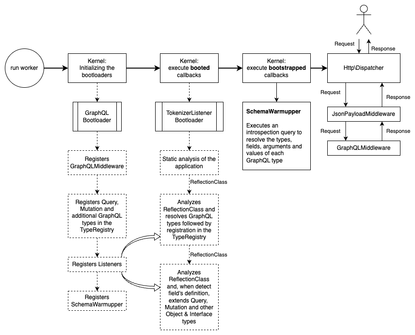

# Development of middleware layers

The process of initializing the application and processing the user request is presented in the diagram below:



When the worker starts, the application is initialized and then waits for a user request,
More details about the application initialization stages can be found in
[official SpiralFramework documentation](https://spiral.dev/docs/framework-kernel/current/en).

Let's take a closer look at initializing the GraphQL server:

1. Starting a worker
2. Initialization of `GraphQLBootloader`
   - registering `GraphQLMiddleware` in `HttpBootloader`. You should make sure that `GraphQLMiddleware` will be
     registered after `JsonPayloadMiddleware` (this was already [written earlier](install.md#bootloader));
   - registration of `Query`, `Mutation` and additional GraphQL types (see [option `additionalTypes`](configure.md))
     in the registry (`TypeRegistry`);
   - registering listeners in `TokenizerListenerRegistryInterface` for static analysis of the application for the purpose
     automatic registration of GraphQL types, Query and Mutation fields, as well as for extending object and
     interface GraphQL types. More information about static application analysis
     [see official SpiralFramework documentation](https://spiral.dev/docs/advanced-tokenizer/current);
   - registering `SchemaWarmupper` to subsequently run the introspection process
     (more about this [just below](#introspection));
3. Calling registered `booted` closures
   - static analysis of the application is carried out;
   - classes, enumerations and interfaces are analyzed. If their definitions fit the criteria of GraphQL types -
     the definition is converted to the corresponding GraphQL type (more details
     [below](#type-resolver)). Analysis and registration of GraphQL types is carried out in the `listen` method of listeners
     ([see details](https://spiral.dev/docs/advanced-tokenizer/current#crafting-a-listener));
   - classes are analyzed. If their definitions fit the criteria for defining fields of ObjectTypes -
     the corresponding types are expanded (see [QueryField](query-filed.md),
     [MutationField](mutation-field.md) and [AdditionalField](additional-field.md)).
     Analysis and extension of GraphQL types is carried out in the `finalize` method of the listeners
     ([see more](https://spiral.dev/docs/advanced-tokenizer/current#crafting-a-listener)). In view of the fact
     that registration in the GraphQL registry of types is carried out in the `listen` method, at the time of calling `finalize` everything
     GraphQL types will already be registered;
4. Calling registered `bootstrapped` closures
   - <a id="introspection">introspection of the GraphQL schema is performed</a>. Wherein:
     - fields are extracted for `ObjectType` and `InterfaceType`. Each field is processed using middleware
       pipeline `ObjectFieldResolver` (more details [below](#object-field-resolver)). Field arguments also
       are retrieved and processed by the middleware pipeline `ArgumentResolver` (more details
       [below](#argument-resolver));
     - for `EnumType` possible values are retrieved;
     - fields are retrieved for `InputObjectType`. Each field is processed using a middleware pipeline
       `InputObjectFieldResolver` (more details [below](#input-object-field-resolver));
     - for `UnionType`, the types included in the UnionType are retrieved.
   - heating of the circuit is completed.
5. The worker waits for a user request and, after receiving it, begins processing it.

## Middleware pipelines

The library uses middleware pipelines in its work. This solution allows you to expand functionality
libraries.

The library uses the following pipelines in its work:
- `TypeResolver` - intended for [defining GraphQL type](#type-resolver);
- `ObjectFieldResolver` - intended for [field definition](#object-field-resolver) object and
  interface GraphQL type;
- `InputObjectFieldResolver` - intended for [field definition](#input-object-field-resolver)
  GraphQL InputObjectType;
- `ArgumentResolver` - intended for [argument definition](#argument-resolver) field.

### <a id="type-resolver">Middleware pipeline for resolving GraphQL type</a>

The `TypeResolver` pipeline implements two main methods:
- `pipe` - is intended for registering the middleware layer in the pipeline with the specified execution priority.
  The higher the priority, the earlier the middleware layer will be called. Layers with the same priority will be
  called in the order they were registered in the pipeline;
- `resolve` - launches the pipeline. The method returns the GraphQL type corresponding to the incoming parameter.

```php
namespace Andi\GraphQL\TypeResolver;

use Andi\GraphQL\TypeResolver\Middleware\MiddlewareInterface;
use Andi\GraphQL\TypeResolver\Middleware\PipelineInterface;
use GraphQL\Type\Definition as Webonyx;

final class TypeResolver implements PipelineInterface
{
    public function resolve(mixed $type): Webonyx\Type
    {
        ...
    }

    public function pipe(MiddlewareInterface $middleware, int $priority = 0): void
    {
        ...
    }
}
```

The middleware layer registered in the pipeline must implement the following interface:

```php
namespace Andi\GraphQL\TypeResolver\Middleware;

use Andi\GraphQL\TypeResolver\TypeResolverInterface;
use GraphQL\Type\Definition as Webonyx;

interface MiddlewareInterface
{
    public function process(mixed $type, TypeResolverInterface $typeResolver): Webonyx\Type;
}
```

If the incoming parameter `$type` can be associated with a GraphQL type, the `process` method should return
corresponding GraphQL type; otherwise, transfer control to the subsequent middleware layer.

Example implementation of a middleware layer:

```php
use GraphQL\Type\Definition as Webonyx;

final class ObjectTypeConfigurationMiddleware implements MiddlewareInterface
{
    public function process(mixed $type, TypeResolverInterface $typeResolver): Webonyx\Type
    {
        $isObjectType = is_array($type)
            && isset($type['name'], $type['fields'])
            && is_string($type['name'])
            && (is_iterable($type['fields']) || is_callable($type['fields']));

        return $isObjectType
            ? new Webonyx\ObjectType($type)
            : $typeResolver->resolve($type);
    }
}
```

In the example above, the middleware layer parses the incoming parameter `$type` if it is an array containing
options `name` and `fields` logic decides that the parameter can be interpreted as
GraphQL ObjectType.

> :point_right: Please note!
>
> The above example of implementing a middleware layer should not be used in the application, because
> the configuration of the GraphQL InputObjectType contains similar configuration options.

To register a middleware layer in the pipeline, specify it in the `typeResolverMiddlewares` option
[configuration](configure.md) libraries. Where the key should be the class name and the value should be the priority
execution.

### <a id="object-field-resolver">Middleware pipeline for resolving a field of an object or interface type</a>

The `ObjectFieldResolver` pipeline implements two main methods:
- `pipe` - is intended for registering the middleware layer in the pipeline with the specified execution priority.
  The higher the priority, the earlier the middleware layer will be called. Layers with the same priority will be
  called in the order they were registered in the pipeline;
- `resolve` - launches the pipeline. The method returns the field definition corresponding to the input one
  parameter.

```php
namespace Andi\GraphQL\ObjectFieldResolver;

use Andi\GraphQL\ObjectFieldResolver\Middleware\MiddlewareInterface;
use Andi\GraphQL\ObjectFieldResolver\Middleware\PipelineInterface;
use GraphQL\Type\Definition as Webonyx;

final class ObjectFieldResolver implements PipelineInterface
{
    public function resolve(mixed $field): Webonyx\FieldDefinition
    {
        ...
    }

    public function pipe(MiddlewareInterface $middleware, int $priority = 0): void
    {
        ...
    }
}
```

The middleware layer registered in the pipeline must implement the following interface:

```php
namespace Andi\GraphQL\ObjectFieldResolver\Middleware;

use Andi\GraphQL\ObjectFieldResolver\ObjectFieldResolverInterface;
use GraphQL\Type\Definition as Webonyx;

interface MiddlewareInterface
{
    public function process(mixed $field, ObjectFieldResolverInterface $fieldResolver): Webonyx\FieldDefinition;
}
```

If the incoming parameter `$field` can be associated with a field of an ObjectType or an InterfaceType,
the `process` method must return the field definition, otherwise transfer control to the next one
middleware layer.

Example implementation of a middleware layer:

```php
namespace Andi\GraphQL\ObjectFieldResolver\Middleware;

use Andi\GraphQL\ObjectFieldResolver\ObjectFieldResolverInterface;
use GraphQL\Type\Definition as Webonyx;

final class WebonyxObjectFieldMiddleware implements MiddlewareInterface
{
    public const PRIORITY = 1024;

    public function process(mixed $field, ObjectFieldResolverInterface $fieldResolver): Webonyx\FieldDefinition
    {
        return $field instanceof Webonyx\FieldDefinition
            ? $field
            : $fieldResolver->resolve($field);
    }
}
```

To register a middleware layer in the pipeline, specify it in the `objectFieldResolverMiddlewares` option
[configuration](configure.md) libraries. Where the key should be the class name and the value should be the priority
execution.

### <a id="input-object-field-resolver">Middleware pipeline for resolving a field of an GraphQL InputObjectType</a>

The `InputObjectFieldResolver` pipeline implements two main methods:
- `pipe` - is intended for registering the middleware layer in the pipeline with the specified execution priority.
  The higher the priority, the earlier the middleware layer will be called. Layers with the same priority will be
  called in the order they were registered in the pipeline;
- `resolve` - launches the pipeline. The method returns the field definition corresponding to the input one
  parameter.

```php
namespace Andi\GraphQL\InputObjectFieldResolver;

use Andi\GraphQL\InputObjectFieldResolver\Middleware\MiddlewareInterface;
use Andi\GraphQL\InputObjectFieldResolver\Middleware\PipelineInterface;
use GraphQL\Type\Definition as Webonyx;

final class InputObjectFieldResolver implements PipelineInterface
{
    public function resolve(mixed $field): Webonyx\InputObjectField
    {
        ...
    }

    public function pipe(MiddlewareInterface $middleware, int $priority = 0): void
    {
        ...
    }
}
```

The middleware layer registered in the pipeline must implement the following interface:

```php
namespace Andi\GraphQL\InputObjectFieldResolver\Middleware;

use Andi\GraphQL\InputObjectFieldResolver\InputObjectFieldResolverInterface;
use GraphQL\Type\Definition as Webonyx;

interface MiddlewareInterface
{
    public function process(mixed $field, InputObjectFieldResolverInterface $fieldResolver): Webonyx\InputObjectField;
}
```

If the incoming parameter `$field` can be associated with a field of the InputObjectType,
the `process` method must return the field definition, otherwise transfer control to the next one
middleware layer.

Example implementation of a middleware layer:

```php
namespace Andi\GraphQL\InputObjectFieldResolver\Middleware;

use Andi\GraphQL\InputObjectFieldResolver\InputObjectFieldResolverInterface;
use GraphQL\Type\Definition as Webonyx;

final class WebonyxInputObjectFieldMiddleware implements MiddlewareInterface
{
    public const PRIORITY = 1024;

    public function process(mixed $field, InputObjectFieldResolverInterface $fieldResolver): Webonyx\InputObjectField
    {
        return $field instanceof Webonyx\InputObjectField
            ? $field
            : $fieldResolver->resolve($field);
    }
}
```

To register a middleware layer in the pipeline, specify it in the `inputObjectFieldResolverMiddlewares` option
[configuration](configure.md) libraries. Where the key should be the class name and the value should be the priority
execution.

### <a id="argument-resolver">Middleware pipeline for field argument resolvement</a>

The `ArgumentResolver` pipeline implements two main methods:
- `pipe` - is intended for registering the middleware layer in the pipeline with the specified execution priority.
  The higher the priority, the earlier the middleware layer will be called. Layers with the same priority will be
  called in the order they were registered in the pipeline;
- `resolve` - launches the pipeline. The method returns the configuration of the argument corresponding
  incoming parameter.

```php
namespace Andi\GraphQL\ArgumentResolver;

use Andi\GraphQL\ArgumentResolver\Middleware\MiddlewareInterface;
use Andi\GraphQL\ArgumentResolver\Middleware\PipelineInterface;

final class ArgumentResolver implements PipelineInterface
{
    public function resolve(mixed $argument): array
    {
        ...
    }

    public function pipe(MiddlewareInterface $middleware, int $priority = 0): void
    {
        ...
    }
}
```

The middleware layer registered in the pipeline must implement the following interface:

```php
namespace Andi\GraphQL\ArgumentResolver\Middleware;

use Andi\GraphQL\ArgumentResolver\ArgumentResolverInterface;

interface MiddlewareInterface
{
    public function process(mixed $argument, ArgumentResolverInterface $argumentResolver): array;
}
```

If the incoming parameter `$argument` can be associated with a field argument, the `process` method must
return the argument configuration, otherwise transfer control to the next middleware layer.

Example implementation of a middleware layer:

```php
namespace Andi\GraphQL\ArgumentResolver\Middleware;

use Andi\GraphQL\ArgumentResolver\ArgumentResolverInterface;
use GraphQL\Type\Definition as Webonyx;

final class ArgumentConfigurationMiddleware implements MiddlewareInterface
{
    public const PRIORITY = 1024;

    public function process(mixed $argument, ArgumentResolverInterface $argumentResolver): array
    {
        $isConfig = is_array($argument)
            && isset($argument['name'], $argument['type'])
            && is_string($argument['name'])
            && $argument['type'] instanceof Webonyx\Type;

        return $isConfig
            ? $argument
            : $argumentResolver->resolve($argument);
    }
}
```

To register a middleware layer in the pipeline, specify it in the `argumentResolverMiddlewares` option
[configuration](configure.md) libraries. Where the key should be the class name and the value should be the priority
execution.
